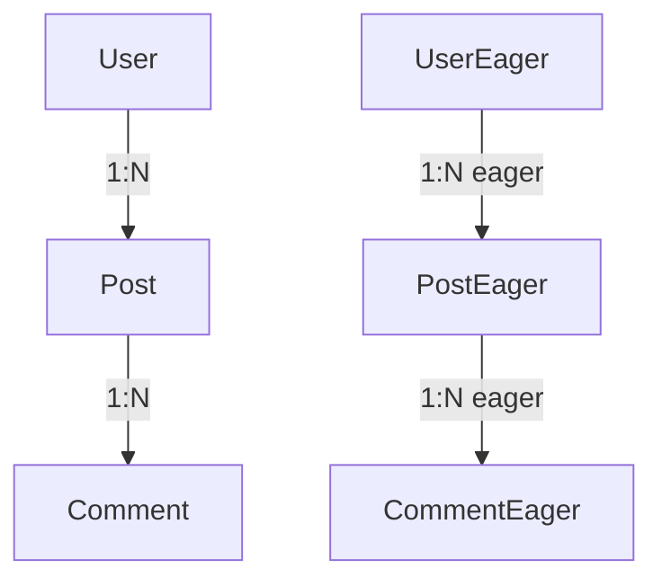

# 04 - Lazy vs Eager Loading

## 🎯 Objetivos de Aprendizaje

- Entender la diferencia entre **Lazy Loading** y **Eager Loading**
- Identificar el **problema N+1** en consultas
- Aprender cuándo usar cada estrategia
- Medir el impacto en performance de diferentes enfoques

## 📚 Conceptos Clave

### Lazy Loading (Carga Perezosa)

- **Por defecto** en TypeORM
- Las relaciones se cargan **solo cuando se accede** a ellas
- Puede causar **múltiples queries** (problema N+1)
- Mejor para casos donde **no siempre** necesitas las relaciones

### Eager Loading (Carga Ansiosa)

- Se configura con `{ eager: true }`
- Las relaciones se cargan **automáticamente** con la entidad principal
- Usa **JOINs** para obtener todo de una vez
- Mejor para casos donde **siempre** necesitas las relaciones

## 🔍 Problema N+1

**¿Qué es?**

- 1 query inicial para obtener entidades principales
- N queries adicionales (una por cada relación)
- Total: 1 + N queries

**Ejemplo:**

```typescript
// 1 query: obtener usuarios
const users = await userRepository.find();

// N queries: una por cada usuario para obtener sus posts
for (const user of users) {
  console.log(user.posts); // ← Query adicional aquí
}
```

## 🚀 Ejecutar el Ejemplo

```bash
npm run lazy-eager
```

## 📊 Qué Verás

### 1. **Lazy Loading Demo**

- Cómo obtener usuarios sin relaciones
- El problema N+1 en acción
- Solución con `relations: []`

### 2. **Eager Loading Demo**

- Carga automática de relaciones
- Una sola query con JOINs
- Datos disponibles inmediatamente

### 3. **Comparación de Performance**

- Conteo de queries SQL ejecutadas
- Tiempo de ejecución comparado
- Análisis de eficiencia

### 4. **Mejores Prácticas**

- Cuándo usar cada estrategia
- Cómo evitar problemas comunes
- Alternativas híbridas

## 🏗️ Estructura del Ejemplo

```
04-lazy-eager/
├── entities/
│   ├── User.ts          # Lazy loading (default)
│   ├── Post.ts          # Relación many-to-one
│   ├── Comment.ts       # Relación many-to-one
│   ├── UserEager.ts     # Eager loading
│   ├── PostEager.ts     # Posts con eager loading
│   └── CommentEager.ts  # Comentarios eager
├── example.ts           # Demo completa
└── README.md           # Este archivo
```

## 📋 Relaciones Demostradas



## 🔧 Configuración Lazy vs Eager

### Lazy Loading (Default)

```typescript
@Entity()
export class User {
  @OneToMany(() => Post, (post) => post.user)
  posts: Post[]; // ← Lazy por defecto
}
```

### Eager Loading

```typescript
@Entity()
export class UserEager {
  @OneToMany(() => PostEager, (post) => post.user, { eager: true })
  posts: PostEager[]; // ← Eager configurado
}
```

## ⚖️ Cuándo Usar Cada Uno

### Usa Lazy Loading cuando:

- ✅ No siempre necesitas las relaciones
- ✅ Tienes control granular sobre las queries
- ✅ Las relaciones son opcionales
- ✅ Quieres optimizar memoria

### Usa Eager Loading cuando:

- ✅ Siempre necesitas las relaciones
- ✅ Las relaciones son pequeñas
- ✅ Quieres evitar el problema N+1
- ✅ Priorizas simplicidad en el código

## 🎓 Lecciones Aprendidas

1. **Lazy Loading** es eficiente para memoria pero puede generar muchas queries
2. **Eager Loading** reduce queries pero puede cargar datos innecesarios
3. El **problema N+1** es un issue común de performance
4. La elección depende del **caso de uso específico**
5. Puedes combinar ambas estrategias en diferentes partes de tu aplicación

## 🔗 Recursos Adicionales

- [TypeORM Relations](https://typeorm.io/relations)
- [Eager and Lazy Relations](https://typeorm.io/eager-and-lazy-relations)
- [Find Options](https://typeorm.io/find-options)
