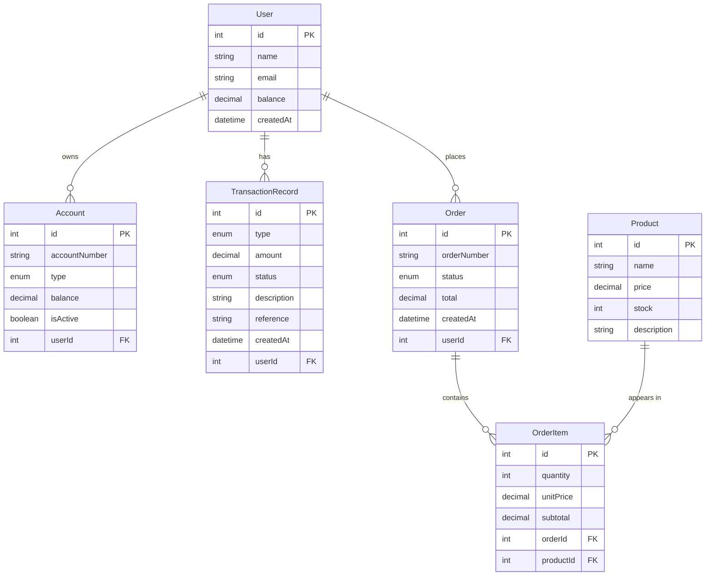

# 05 - Transacciones en TypeORM

## 🎯 Objetivos de Aprendizaje

- Comprender las **propiedades ACID** de las transacciones
- Aprender a manejar **transacciones simples** con QueryRunner
- Implementar **rollback automático** en casos de error
- Dominar **transacciones anidadas** con savepoints
- Aplicar patrones de **consistencia de datos**

## 📚 Conceptos Fundamentales

### 🔐 Propiedades ACID

| Propiedad        | Descripción                  | Ejemplo                                   |
| ---------------- | ---------------------------- | ----------------------------------------- |
| **Atomicidad**   | Todo o nada                  | Transferencia: debitar Y acreditar juntos |
| **Consistencia** | Estado válido siempre        | Balance nunca negativo                    |
| **Aislamiento**  | Transacciones independientes | Una transferencia no ve otra a medias     |
| **Durabilidad**  | Cambios permanentes          | Datos persisten tras confirmación         |

### 🔄 Tipos de Transacciones

**1. Transacción Simple**

- Una secuencia de operaciones relacionadas
- Se confirman o revierten todas juntas

**2. Transacción con Rollback**

- Manejo de errores con reversión automática
- Preserva la integridad ante fallos

**3. Transacciones Anidadas**

- Sub-transacciones con savepoints
- Rollback parcial o total según el nivel

## 🚀 Ejecutar el Ejemplo

```bash
npm run transactions
```

## 📊 Casos Demostrados

### 1. **Transacción Simple** 💰

**Escenario:** Crear usuario y cuenta bancaria

- Crear usuario con balance inicial
- Crear cuenta asociada
- Registrar transacción de depósito inicial
- **Todas las operaciones o ninguna**

### 2. **Transacción con Rollback** 🔄

**Escenario:** Transferencia que falla por fondos insuficientes

- Intentar transferir más dinero del disponible
- Detectar error de fondos insuficientes
- **Rollback automático** preserva balances originales
- Registrar transacción como fallida

### 3. **Transacciones Anidadas** 🔗

**Escenario:** Pedido con múltiples items e inventario

- Transacción principal: crear pedido
- Sub-transacciones: procesar cada item
- Verificar stock disponible
- Actualizar inventario y procesar pago
- **Rollback en cascada** si falla cualquier item

## 🏗️ Entidades del Ejemplo



## 💻 Patrones de Código

### QueryRunner Básico

```typescript
const queryRunner = AppDataSource.createQueryRunner();
await queryRunner.connect();
await queryRunner.startTransaction();

try {
  // Operaciones de la transacción
  await queryRunner.manager.save(entity);

  // Confirmar
  await queryRunner.commitTransaction();
} catch (error) {
  // Rollback automático
  await queryRunner.rollbackTransaction();
  throw error;
} finally {
  // Liberar recursos
  await queryRunner.release();
}
```

### Transacciones Anidadas con Savepoints

```typescript
await queryRunner.startTransaction(); // Transacción principal

for (const item of items) {
  await queryRunner.startTransaction("item_processing"); // Savepoint

  try {
    // Procesar item
    await queryRunner.manager.save(item);
    await queryRunner.commitTransaction(); // Confirmar savepoint
  } catch (error) {
    await queryRunner.rollbackTransaction(); // Rollback hasta savepoint
    throw error;
  }
}

await queryRunner.commitTransaction(); // Confirmar principal
```

## 📋 Escenarios de Uso Real

### ✅ Cuándo Usar Transacciones

1. **Transferencias monetarias**

   - Debitar cuenta origen + acreditar destino
   - Garantizar que ambas operaciones ocurran

2. **Pedidos de e-commerce**

   - Crear pedido + reducir inventario + procesar pago
   - Rollback si cualquier paso falla

3. **Actualización de datos relacionados**

   - Modificar entidad principal + entidades dependientes
   - Mantener consistencia referencial

4. **Operaciones críticas del negocio**
   - Procesos que no pueden quedar a medias
   - Estados intermedios inválidos

### ❌ Cuándo NO Usar Transacciones

1. **Operaciones de solo lectura**

   - Consultas que no modifican datos
   - Reportes y análisis

2. **Operaciones independientes**

   - Cambios que no afectan otros datos
   - Actualizaciones aisladas

3. **Procesos de larga duración**
   - Operaciones que requieren input del usuario
   - Pueden bloquear la base de datos

## 🔍 Análisis de Resultados

Al ejecutar el ejemplo verás:

### Caso 1: Transacción Simple ✅

```
✅ Usuario creado: Diana García (diana@email.com) - Balance: $1500
✅ Cuenta creada: ACC-001-2024 (checking) - Balance: $1500
✅ Transacción registrada: DEPOSIT - $1500 (completed)
✅ Transacción confirmada exitosamente
```

### Caso 2: Rollback 🔄

```
⚠️ Error detectado durante la transferencia:
   Fondos insuficientes. Balance actual: $1000, monto requerido: $1500
🔄 Transacción revertida (ROLLBACK)
✅ Los balances permanecen sin cambios
```

### Caso 3: Transacciones Anidadas 🔗

```
✅ Pedido creado: Order #ORD-1234567890 - Total: $1119.97 (pending)
   ✅ Item 1 procesado exitosamente
   ✅ Item 2 procesado exitosamente
   ✅ Item 3 procesado exitosamente
💳 Pago procesado: $1119.97
🎉 TRANSACCIÓN PRINCIPAL COMPLETADA EXITOSAMENTE
```

## ⚠️ Consideraciones Importantes

### Performance

- **Mantén transacciones cortas**: Reduce bloqueos
- **Evita operaciones lentas**: No I/O durante transacciones
- **Libera recursos**: Siempre usa `finally` con `release()`

### Manejo de Errores

- **Captura específica**: Diferentes tipos de error
- **Rollback explícito**: En algunos casos manuales
- **Logging apropiado**: Registra fallos para auditoría

### Concurrencia

- **Deadlocks**: Ordena las operaciones consistentemente
- **Nivel de aislamiento**: Configura según necesidades
- **Timeouts**: Evita transacciones colgadas

## 🎓 Lecciones Aprendidas

1. **ACID garantiza consistencia** - Las transacciones mantienen la integridad
2. **Rollback es automático** - Los errores revierten cambios automáticamente
3. **Savepoints permiten granularidad** - Control fino con transacciones anidadas
4. **Always use try/catch/finally** - Patrón esencial para transacciones
5. **Diseña para la consistencia** - Piensa en estados intermedios inválidos

## 🔗 Recursos Adicionales

- [TypeORM Transactions](https://typeorm.io/transactions)
- [Database ACID Properties](https://en.wikipedia.org/wiki/ACID)
- [Transaction Isolation Levels](https://typeorm.io/transactions#isolation-levels)
