# 06 - Objetos Embebidos en TypeORM

## 🎯 Objetivos de Aprendizaje

- Comprender el concepto de **objetos embebidos** (embedded objects)
- Aprender a usar **`@Column(() => Class)`** para mapear objetos complejos
- Implementar **transformers** para tipos de datos complejos (arrays, JSON)
- Dominar diferentes patrones de **mapeo de datos** en una sola tabla
- Aplicar **métodos de negocio** en objetos embebidos

## 📚 Conceptos Fundamentales

### 🏗️ ¿Qué son los Objetos Embebidos?

Los **objetos embebidos** permiten mapear objetos complejos a columnas de una tabla sin crear relaciones entre tablas. Se "aplanan" en la estructura de la tabla principal.

### 🔄 Tipos de Mapeo Embebido

| Tipo | Descripción | Ejemplo |
|------|-------------|---------|
| **Múltiples Columnas** | Un objeto se mapea a varias columnas | Address → `street`, `city`, `zipCode`, `country` |
| **Separado por Comas** | Array se almacena como string | `["tag1", "tag2"]` → `"tag1,tag2"` |
| **JSON** | Objeto complejo como JSON | `{theme: "dark"}` → `'{"theme":"dark"}'` |

### ⚡ Ventajas vs Desventajas

**✅ Ventajas:**
- Sin JOINs necesarios
- Consultas más rápidas
- Datos cohesivos
- Fácil de entender

**❌ Desventajas:**
- No reutilizable entre entidades
- Duplicación de columnas
- Queries complejas para filtrar

## 🚀 Ejecutar el Ejemplo

```bash
npm run embedded
```

## 📊 Casos Demostrados

### 1. **Direcciones Embebidas** 🏢
**Escenario:** Empresa con dirección principal y de facturación
- Mapeo de `Address` a múltiples columnas con prefijos
- Comparación de direcciones
- Validación de información

### 2. **Información Compleja Embebida** 👥
**Escenario:** Empleado con contacto, trabajo y skills
- Múltiples objetos embebidos en una entidad
- Transformers para arrays y JSON
- Métodos de negocio en objetos embebidos

### 3. **Consultas con Campos Embebidos** 🔍
**Escenario:** Filtrar por propiedades de objetos embebidos
- Consultas SQL directas a campos embebidos
- QueryBuilder con campos "aplanados"

### 4. **Manipulación Dinámica** ⚙️
**Escenario:** Modificar objetos embebidos en tiempo de ejecución
- Agregar/quitar elementos de arrays
- Actualizar configuraciones JSON
- Persistir cambios

## 🏗️ Entidades del Ejemplo

```mermaid
erDiagram
    Company ||--o{ Address : embeds
    Company ||--o{ Settings : embeds
    Employee ||--o{ Address : embeds
    Employee ||--o{ ContactInfo : embeds
    Employee ||--o{ WorkInfo : embeds
    
    Company {
        int id PK
        string name
        string email
        string phone
        string website
        string main_address_street
        string main_address_city
        string main_address_zipCode
        string main_address_country
        string billing_address_street
        string billing_address_city
        string billing_address_zipCode
        string billing_address_country
        text tags
        text settings
        boolean isActive
        datetime createdAt
        datetime updatedAt
    }
    
    Employee {
        int id PK
        string firstName
        string lastName
        string documentNumber
        string home_street
        string home_city
        string home_zipCode
        string home_country
        string contact_email
        string contact_phone
        string contact_emergencyContact
        string contact_emergencyPhone
        string work_department
        string work_position
        decimal work_salary
        date work_hireDate
        string work_manager
        text skills
        text performance
        boolean isActive
        datetime createdAt
        datetime updatedAt
    }
```



## 💻 Patrones de Código

### Objeto Embebido Básico
```typescript
export class Address {
  @Column()
  street!: string;

  @Column()
  city!: string;

  // Métodos de negocio
  getFullAddress(): string {
    return `${this.street}, ${this.city}`;
  }
}

@Entity()
export class Company {
  @Column(() => Address, { prefix: "main_address_" })
  mainAddress!: Address;
}
```

### Transformer para Arrays
```typescript
@Column({ 
  type: "text", 
  transformer: {
    to: (value: string[]) => value ? value.join(',') : '',
    from: (value: string) => value ? value.split(',') : []
  }
})
tags!: string[];
```

### Transformer para JSON
```typescript
@Column({ 
  type: "text", 
  transformer: {
    to: (value: any) => JSON.stringify(value),
    from: (value: string) => JSON.parse(value || '{}')
  }
})
settings!: {
  theme: string;
  notifications: boolean;
};
```

### Consultas con Campos Embebidos
```typescript
// QueryBuilder con campos "aplanados"
const companies = await repository
  .createQueryBuilder("company")
  .where("company.main_address_city = :city", { city: "Buenos Aires" })
  .getMany();
```

## 📋 Escenarios de Uso Real

### ✅ Cuándo Usar Objetos Embebidos

1. **Información de dirección**
   - Direcciones postales
   - Ubicaciones geográficas
   - Datos que siempre van juntos

2. **Configuraciones simples**
   - Preferencias de usuario
   - Settings de aplicación
   - Metadatos pequeños

3. **Datos cohesivos**
   - Información de contacto
   - Detalles de producto
   - Datos que no necesitan ser reutilizados

4. **Arrays simples**
   - Tags o etiquetas
   - Listas de categorías
   - Skills o habilidades

### ❌ Cuándo NO Usar Objetos Embebidos

1. **Datos que necesitan relaciones**
   - Referencias a otras entidades
   - Datos que requieren integridad referencial

2. **Información reutilizable**
   - Entidades que se usan en múltiples lugares
   - Datos que requieren normalización

3. **Consultas complejas**
   - Datos que requieren filtros avanzados
   - Información que necesita índices específicos

4. **Datos grandes**
   - Objetos JSON muy grandes
   - Arrays con muchos elementos

## 🔍 Análisis de Resultados

Al ejecutar el ejemplo verás:

### Caso 1: Direcciones Embebidas 🏢
```
✅ Empresa creada: TechCorp SA
📍 Ubicación principal: Buenos Aires, Argentina
📄 Facturación: Córdoba, Argentina
🏷️ Tags: technology, software, innovation
🔄 Misma dirección: No
```

### Caso 2: Información Embebida 👥
```
✅ Empleado creado: María González - Senior Developer en Engineering
📍 Ubicación: Buenos Aires, Argentina
🆘 Emergencia: Configurado
💼 Experiencia: 4 años (Senior)
🎯 Skills: JavaScript, TypeScript, React, Node.js, PostgreSQL
⭐ Rating: 4.5/5
```

### Caso 3: Consultas 🔍
```
🏢 Empresas en Buenos Aires: 2
  • TechCorp SA - Buenos Aires, Argentina
  • StartupHub - Buenos Aires, Argentina

👨‍💻 Empleados de Engineering: 2
  • María González - Senior Developer en Engineering
    💰 Salario: $150,000
```

## ⚙️ Estructura de Base de Datos

### Tabla `companies`
```sql
CREATE TABLE companies (
  id INTEGER PRIMARY KEY,
  name VARCHAR NOT NULL,
  email VARCHAR NOT NULL,
  -- Dirección principal (embebida con prefijo)
  main_address_street VARCHAR,
  main_address_city VARCHAR,
  main_address_zipCode VARCHAR,
  main_address_country VARCHAR,
  -- Dirección de facturación (embebida con prefijo)
  billing_address_street VARCHAR,
  billing_address_city VARCHAR,
  billing_address_zipCode VARCHAR,
  billing_address_country VARCHAR,
  -- Arrays y JSON como texto
  tags TEXT,
  settings TEXT,
  isActive BOOLEAN DEFAULT 1
);
```

### Ejemplo de Datos
```sql
INSERT INTO companies VALUES (
  1,
  'TechCorp SA',
  'contact@techcorp.com',
  -- main_address_*
  'Av. Corrientes 1234',
  'Buenos Aires', 
  'C1043AAZ',
  'Argentina',
  -- billing_address_*
  'San Martín 567',
  'Córdoba',
  'X5000',
  'Argentina',
  -- transformers
  'technology,software,innovation',
  '{"theme":"dark","notifications":true}',
  1
);
```

## 🎓 Lecciones Aprendidas

1. **Objetos embebidos simplifican** - Menos tablas, consultas más directas
2. **Prefijos evitan colisiones** - Múltiples objetos del mismo tipo
3. **Transformers son poderosos** - Mapeo automático de tipos complejos
4. **Métodos de negocio** - Lógica en los objetos embebidos
5. **Performance vs flexibilidad** - Trade-off importante a considerar

## 🔗 Recursos Adicionales

- [TypeORM Embedded Entities](https://typeorm.io/embedded-entities)
- [Column Transformers](https://typeorm.io/entities#column-types-for-postgres-cockroachdb-and-mysql--mariadb)
- [JSON Support in SQLite](https://www.sqlite.org/json1.html) 