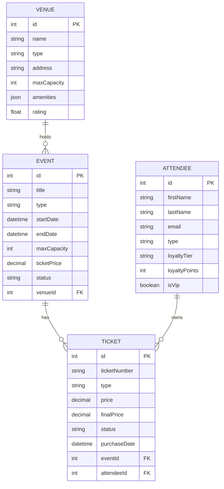

# Ejercicio 4: Lazy vs Eager Loading

## 🎯 Objetivos de Aprendizaje

Este ejercicio te permitirá:

- Comprender la diferencia entre **Lazy Loading** y **Eager Loading**
- Identificar y resolver el **problema N+1** en consultas
- Comparar el rendimiento entre ambos enfoques
- Implementar mejores prácticas para optimizar consultas
- Saber cuándo usar cada estrategia según el caso de uso

## 📚 Conceptos Clave

### Lazy Loading (Carga Perezosa)

- **Comportamiento por defecto** en TypeORM
- Las relaciones se cargan **solo cuando se accede** a ellas
- Puede causar **múltiples queries** (problema N+1)
- Mejor para casos donde **no siempre** necesitas las relaciones
- Optimiza el uso de **memoria**

### Eager Loading (Carga Ansiosa)

- Se configura con `{ eager: true }` en las relaciones
- Las relaciones se cargan **automáticamente** con la entidad principal
- Usa **JOINs** para obtener todo de una vez
- Mejor para casos donde **siempre** necesitas las relaciones
- Optimiza el **número de queries**

## 🔍 El Problema N+1

### ¿Qué es el Problema N+1?

El problema N+1 ocurre cuando:

1. Se ejecuta **1 query** para obtener N entidades principales
2. Se ejecutan **N queries adicionales** para obtener las relaciones de cada entidad
3. **Total: 1 + N queries** en lugar de una sola query optimizada

### Ejemplo del Problema N+1

```typescript
// ❌ PROBLEMA N+1
const events = await eventRepository.find(); // 1 query

for (const event of events) {
  console.log(event.venue.name); // N queries (una por cada event)
  console.log(event.tickets.length); // N queries más
}
// Total: 1 + N + N = 1 + 2N queries
```

### Solución al Problema N+1

```typescript
// ✅ SOLUCIÓN 1: Relations explícitas
const events = await eventRepository.find({
  relations: ["venue", "tickets"],
}); // 1 query con JOINs

for (const event of events) {
  console.log(event.venue.name); // No genera queries adicionales
  console.log(event.tickets.length); // No genera queries adicionales
}
// Total: 1 query

// ✅ SOLUCIÓN 2: Eager loading
@Entity()
export class Event {
  @ManyToOne(() => Venue, { eager: true })
  venue: Venue;

  @OneToMany(() => Ticket, { eager: true })
  tickets: Ticket[];
}

const events = await eventRepository.find(); // 1 query con JOINs automáticos
```

## 🏗️ Estructura del Ejercicio

```
ejercicio-04-lazy-eager/
├── entities/
│   ├── Event.ts          # Lazy loading (por defecto)
│   ├── Venue.ts          # Lazy loading
│   ├── Attendee.ts       # Lazy loading
│   ├── Ticket.ts         # Lazy loading
│   ├── EventEager.ts     # Eager loading
│   ├── VenueEager.ts     # Eager loading
│   ├── AttendeeEager.ts  # Eager loading
│   └── TicketEager.ts    # Eager loading
├── example.ts            # Demostración completa
└── README.md            # Esta documentación
```

## 📋 Entidades y Relaciones

### Dominio: Sistema de Gestión de Eventos



### Relaciones Implementadas

1. **Venue → Event** (One-to-Many)

   - Un venue puede hospedar múltiples eventos
   - Un evento pertenece a un venue

2. **Event → Ticket** (One-to-Many)

   - Un evento puede tener múltiples tickets
   - Un ticket pertenece a un evento

3. **Attendee → Ticket** (One-to-Many)
   - Un attendee puede tener múltiples tickets
   - Un ticket pertenece a un attendee

## 🔧 Configuración de Lazy vs Eager Loading

### Lazy Loading (Por Defecto)

```typescript
@Entity()
export class Event {
  @ManyToOne(() => Venue, (venue) => venue.events)
  venue: Venue; // ← Lazy por defecto

  @OneToMany(() => Ticket, (ticket) => ticket.event)
  tickets: Ticket[]; // ← Lazy por defecto
}
```

### Eager Loading

```typescript
@Entity()
export class EventEager {
  @ManyToOne(() => VenueEager, (venue) => venue.events, {
    eager: true, // ← Eager loading activado
  })
  venue: VenueEager;

  @OneToMany(() => TicketEager, (ticket) => ticket.event, {
    eager: true, // ← Eager loading activado
  })
  tickets: TicketEager[];
}
```

## 🚀 Ejecutar el Ejercicio

### Instalación

```bash
# Ir al directorio del ejercicio
cd unidad1/clases/II/ejercicios

# Instalar dependencias (si no están instaladas)
npm install

# Ejecutar el ejercicio 4
npm run ejercicio-04-lazy-eager
```

### Comando del package.json

```json
{
  "scripts": {
    "ejercicio-04-lazy-eager": "ts-node src/ejercicio-04-lazy-eager/example.ts"
  }
}
```

## 📊 Demostraciones Incluidas

### 1. Lazy Loading Demo

- Muestra cómo las relaciones NO se cargan automáticamente
- Demuestra el problema N+1 en acción
- Cuenta las queries SQL ejecutadas

### 2. Eager Loading Demo

- Muestra cómo las relaciones SE cargan automáticamente
- Demuestra la solución al problema N+1
- Una sola query con JOINs

### 3. Consultas Avanzadas

- Comparación de lazy vs eager en consultas complejas
- Uso de `relations` explícitas vs eager automático
- Análisis de datos cargados

### 4. Comparación de Performance

- Medición de tiempos de ejecución
- Conteo de queries ejecutadas
- Escenarios de uso común

### 5. Mejores Prácticas

- Relations específicas vs eager global
- Query Builder para consultas optimizadas
- Paginación eficiente
- Carga selectiva

## ⚖️ Cuándo Usar Cada Estrategia

### Usa Lazy Loading cuando:

- ✅ **No siempre necesitas las relaciones**
- ✅ **Las relaciones son opcionales** para el caso de uso
- ✅ **Quieres optimizar memoria** (no cargar datos innecesarios)
- ✅ **Tienes control granular** sobre las queries
- ✅ **Las relaciones son grandes** o complejas
- ✅ **Usas paginación** y no necesitas todas las relaciones

### Usa Eager Loading cuando:

- ✅ **Siempre necesitas las relaciones**
- ✅ **Las relaciones son pequeñas** y manejables
- ✅ **Quieres evitar el problema N+1**
- ✅ **Priorizas simplicidad** en el código
- ✅ **Realizas operaciones en memoria** con los datos cargados
- ✅ **La performance de lectura** es crítica

## 🏆 Mejores Prácticas

### 1. Enfoque Híbrido

```typescript
// Usa lazy por defecto, eager cuando sea necesario
@Entity()
export class Event {
  @ManyToOne(() => Venue, { eager: true }) // Siempre necesario
  venue: Venue;

  @OneToMany(() => Ticket, { eager: false }) // Ocasionalmente necesario
  tickets: Ticket[];
}
```

### 2. Relations Específicas

```typescript
// Carga solo las relaciones que necesitas
const events = await eventRepository.find({
  relations: ["venue"], // Solo venue, no tickets
  where: { status: EventStatus.PUBLISHED },
});
```

### 3. Query Builder para Casos Complejos

```typescript
const events = await eventRepository
  .createQueryBuilder("event")
  .leftJoinAndSelect("event.venue", "venue")
  .leftJoinAndSelect("event.tickets", "tickets", "tickets.status = :status")
  .setParameter("status", TicketStatus.CONFIRMED)
  .getMany();
```

### 4. Paginación con Relaciones

```typescript
const tickets = await ticketRepository.find({
  relations: ["event", "attendee"],
  take: 20,
  skip: page * 20,
  order: { createdAt: "DESC" },
});
```

### 5. Carga Selectiva

```typescript
const events = await eventRepository.find({
  select: ["id", "title", "startDate"],
  relations: ["venue"],
  where: { status: EventStatus.PUBLISHED },
});
```

## 📈 Métricas de Performance

### Lazy Loading (Problema N+1)

- **Queries**: 1 + N (por cada relación)
- **Memoria**: Baja (solo lo necesario)
- **Tiempo**: Alto (múltiples round-trips)
- **Complejidad**: Baja

### Eager Loading (Solución)

- **Queries**: 1 (con JOINs)
- **Memoria**: Alta (todo cargado)
- **Tiempo**: Bajo (un solo round-trip)
- **Complejidad**: Media

### Relations Específicas (Óptimo)

- **Queries**: 1 (con JOINs selectivos)
- **Memoria**: Media (solo lo necesario)
- **Tiempo**: Bajo (un solo round-trip)
- **Complejidad**: Media

## 🔍 Monitoreo y Debugging

### Habilitar Query Logging

```typescript
// En data-source.ts
export const dataSource = new DataSource({
  // ... otras configuraciones
  logging: true, // ← Habilita logging de queries
  logger: "advanced-console",
});
```

### Usar Query Builder con Logging

```typescript
const query = eventRepository
  .createQueryBuilder("event")
  .leftJoinAndSelect("event.venue", "venue");

console.log("SQL:", query.getSql());
console.log("Parameters:", query.getParameters());
```

### Medir Performance

```typescript
function measureTime<T>(operation: () => Promise<T>, name: string): Promise<T> {
  const start = performance.now();
  return operation().then((result) => {
    const end = performance.now();
    console.log(`${name}: ${(end - start).toFixed(2)}ms`);
    return result;
  });
}
```

## 🎓 Ejercicios Propuestos

### Ejercicio 1: Análisis del Problema N+1

1. Ejecuta el ejemplo y observa el número de queries
2. Identifica dónde ocurre el problema N+1
3. Propón soluciones alternativas

### Ejercicio 2: Optimización de Consultas

1. Crea una consulta que obtenga eventos con sus tickets confirmados
2. Implementa paginación en la consulta
3. Compara performance con y sin eager loading

### Ejercicio 3: Dashboard de Estadísticas

1. Crea un dashboard que muestre:
   - Total de eventos por venue
   - Revenue por evento
   - Top 5 attendees por tickets comprados
2. Implementa con lazy loading
3. Optimiza con eager loading o relations específicas

### Ejercicio 4: Búsqueda Avanzada

1. Implementa búsqueda de eventos por:
   - Texto en título
   - Tipo de evento
   - Rango de fechas
   - Venue específico
2. Incluye datos de tickets y attendees
3. Optimiza para performance

## 🔗 Recursos Adicionales

- [TypeORM Relations](https://typeorm.io/relations)
- [Eager and Lazy Relations](https://typeorm.io/eager-and-lazy-relations)
- [Query Builder](https://typeorm.io/select-query-builder)
- [Find Options](https://typeorm.io/find-options)
- [Performance Optimization](https://typeorm.io/performance-optimization)

## 💡 Consejos Importantes

1. **No hay una solución única** - el enfoque óptimo depende del caso de uso
2. **Monitorea las queries SQL** generadas en desarrollo
3. **Combina lazy y eager** según tus necesidades específicas
4. **Usa paginación** para grandes volúmenes de datos
5. **Considera el impacto en memoria** vs número de queries
6. **Implementa caching** para consultas frecuentes
7. **Usa índices** en las columnas de relaciones
8. **Prueba con datos realistas** en volumen

## 🚨 Advertencias

- ⚠️ **Eager loading con relaciones grandes** puede consumir mucha memoria
- ⚠️ **Múltiples eager relations** pueden generar queries muy complejas
- ⚠️ **Lazy loading sin control** puede causar problemas de performance
- ⚠️ **Circular references** en eager loading pueden causar errores
- ⚠️ **Eager loading en entidades padre** puede cargar datos innecesarios

---

¡Explora el código, experimenta con diferentes enfoques y encuentra el equilibrio perfecto entre performance y simplicidad! 🚀
