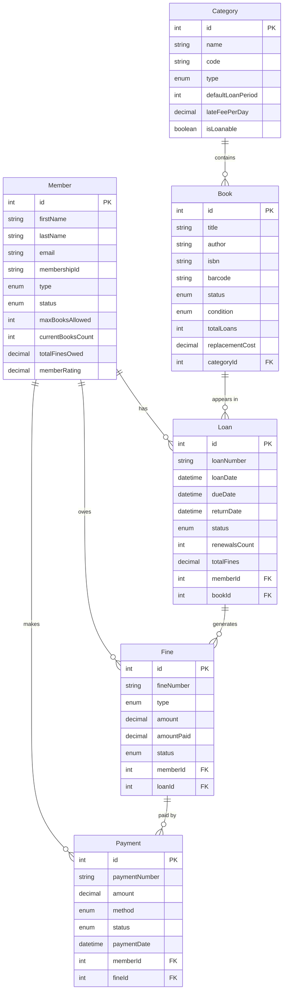

# Ejercicio 5: Transacciones en TypeORM

## 🎯 Objetivos de Aprendizaje

Este ejercicio está diseñado para enseñar los conceptos fundamentales de **transacciones en TypeORM** a través de un sistema de gestión de biblioteca. Aprenderás:

- **Propiedades ACID** y su importancia en aplicaciones reales
- **Transacciones simples** con QueryRunner
- **Manejo de errores** y rollback automático
- **Transacciones anidadas** con savepoints
- **Casos de uso del mundo real** con operaciones críticas

## 📚 Conceptos Fundamentales

### 🔐 Propiedades ACID

Las transacciones deben cumplir con las propiedades ACID:

| Propiedad        | Descripción                  | Ejemplo en el Sistema                       |
| ---------------- | ---------------------------- | ------------------------------------------- |
| **Atomicidad**   | Todo o nada                  | Préstamo: actualizar libro Y miembro juntos |
| **Consistencia** | Estado válido siempre        | Libros disponibles nunca negativos          |
| **Aislamiento**  | Transacciones independientes | Dos préstamos simultáneos no interfieren    |
| **Durabilidad**  | Cambios permanentes          | Multas pagadas persisten tras confirmación  |

### 🔄 Tipos de Transacciones

**1. Transacción Simple**

```typescript
const queryRunner = AppDataSource.createQueryRunner();
await queryRunner.connect();
await queryRunner.startTransaction();

try {
  // Operaciones relacionadas
  await queryRunner.manager.save(loan);
  await queryRunner.manager.save(book);
  await queryRunner.manager.save(member);

  await queryRunner.commitTransaction();
} catch (error) {
  await queryRunner.rollbackTransaction();
  throw error;
} finally {
  await queryRunner.release();
}
```

**2. Transacciones Anidadas con Savepoints**

```typescript
await queryRunner.startTransaction(); // Principal

try {
  // Operación 1
  await queryRunner.startTransaction("savepoint1");
  try {
    await queryRunner.manager.save(entity1);
    await queryRunner.commitTransaction();
  } catch (error) {
    await queryRunner.rollbackTransaction(); // Solo al savepoint
    throw error;
  }

  // Operación 2
  await queryRunner.startTransaction("savepoint2");
  try {
    await queryRunner.manager.save(entity2);
    await queryRunner.commitTransaction();
  } catch (error) {
    await queryRunner.rollbackTransaction(); // Solo al savepoint
    // La operación 1 se mantiene
  }

  await queryRunner.commitTransaction(); // Confirmar principal
} catch (error) {
  await queryRunner.rollbackTransaction(); // Rollback total
} finally {
  await queryRunner.release();
}
```

## 🏗️ Entidades del Sistema

### Diagrama de Relaciones



### Entidades Principales

#### 👥 Member (Miembro)

- **Tipos**: Student, Faculty, Staff, Public, Senior
- **Estados**: Active, Inactive, Suspended, Expired, Blocked
- **Límites**: Libros permitidos, período de préstamo, multas máximas
- **Métodos**: Elegibilidad, rating, historial

#### 📚 Book (Libro)

- **Estados**: Available, Borrowed, Reserved, Maintenance, Lost, Damaged
- **Propiedades**: ISBN, código de barras, categoría, precio, ubicación
- **Métodos**: Disponibilidad, préstamo, devolución, reserva

#### 📖 Category (Categoría)

- **Tipos**: Fiction, Non-fiction, Reference, Academic, Children
- **Políticas**: Período de préstamo, multas, restricciones
- **Jerarquía**: Categorías padre e hijas

#### 📋 Loan (Préstamo)

- **Estados**: Active, Returned, Overdue, Renewed, Lost, Damaged
- **Funciones**: Renovación, cálculo de multas, notificaciones
- **Historial**: Renovaciones, notificaciones, inspecciones

#### 💰 Fine (Multa)

- **Tipos**: Overdue, Lost book, Damaged book, Processing
- **Estados**: Pending, Paid, Partially paid, Waived, Disputed
- **Funciones**: Pagos, condonación, disputa, intereses

#### 💳 Payment (Pago)

- **Métodos**: Cash, Credit card, Bank transfer, Online
- **Estados**: Pending, Completed, Failed, Refunded
- **Funciones**: Procesamiento, reembolso, disputa

## 🚀 Casos de Uso Demostrados

### 1. Transacción Simple - Préstamo de Libro

```typescript
// Verificar elegibilidad → Crear préstamo → Actualizar estados
// Todo en una sola transacción atómica
```

### 2. Transacción con Rollback - Manejo de Errores

```typescript
// Intento de préstamo que falla por límite excedido
// Rollback automático preserva consistencia
```

### 3. Transacciones Anidadas - Devolución Completa

```typescript
// Savepoint 1: Procesar devolución
// Savepoint 2: Crear multa por atraso
// Savepoint 3: Procesar pago de multa
// Rollback selectivo según el punto de fallo
```

### 4. Transacción Compleja - Renovación Múltiple

```typescript
// Renovar múltiples préstamos con validaciones
// Continuar con éxitos parciales
```

### 5. Migración de Datos - Actualización Masiva

```typescript
// Actualizar políticas de múltiples entidades
// Rollback completo si falla cualquier parte
```

## 🛠️ Cómo Ejecutar

### Prerrequisitos

```bash
# Instalar dependencias
npm install

# Configurar base de datos (SQLite para desarrollo)
npm run setup
```

### Ejecutar el Ejercicio

```bash
# Ejecutar demostración completa
npm run ejercicio-05

# O ejecutar directamente
npx ts-node src/ejercicio-05-transacciones/example.ts
```

### Salida Esperada

```
🚀 INICIANDO DEMOSTRACIÓN DE TRANSACCIONES EN TYPEORM
Sistema de Gestión de Biblioteca

🗂️  Creando datos de ejemplo...
✅ Datos de ejemplo creados exitosamente

================================================================================
📚 CASO 1: TRANSACCIÓN SIMPLE - PRÉSTAMO DE LIBRO
================================================================================
[Transaction 1] Iniciando préstamo de libro
👤 Miembro: Ana García
📖 Libro: Don Quijote de la Mancha
[Transaction 1] Préstamo completado exitosamente
✅ Préstamo creado exitosamente:
   Préstamo: LN-xxx-xxx: Ana García - Don Quijote de la Mancha...
   Libro ahora: 📚 Prestado - Vence en 14 días
   Miembro ahora: 1/10 libros
```

## 🔍 Análisis de Resultados

### Métricas de Transacciones

- **Tiempo de ejecución**: Medido por caso
- **Consultas ejecutadas**: Conteo automático
- **Rollbacks**: Detectados y registrados
- **Consistencia**: Verificada después de cada operación

### Casos de Éxito

- ✅ Préstamo simple completado
- ✅ Rollback automático funcionando
- ✅ Transacciones anidadas exitosas
- ✅ Operaciones complejas manejadas
- ✅ Migración masiva consistente

### Casos de Error Simulados

- ❌ Límite de libros excedido
- ❌ Libro no disponible
- ❌ Multas pendientes
- ❌ Error en migración de datos
- ❌ Fallo en procesamiento de pagos

## 🔧 Características Técnicas

### Funciones de Monitoreo

```typescript
// Conteo automático de consultas
function logQuery(query: string) {
  queryCount++;
  console.log(`[Query ${queryCount}] ${query}`);
}

// Seguimiento de transacciones
function logTransaction(operation: string) {
  transactionCount++;
  console.log(`[Transaction ${transactionCount}] ${operation}`);
}
```

### Validaciones de Negocio

- **Elegibilidad de préstamos**: Estado del miembro, límites, multas
- **Disponibilidad de libros**: Estado, reservas, mantenimiento
- **Políticas de renovación**: Límites, multas pendientes
- **Procesamiento de pagos**: Montos, métodos, autorización

### Manejo de Errores

- **Rollback automático**: En caso de excepción
- **Savepoints**: Para rollback parcial
- **Validaciones**: Antes de operaciones críticas
- **Logs detallados**: Para debugging y auditoría

## 📊 Patrones de Código Utilizados

### 1. QueryRunner Pattern

```typescript
const queryRunner = AppDataSource.createQueryRunner();
await queryRunner.connect();
await queryRunner.startTransaction();
// ... operaciones ...
await queryRunner.commitTransaction();
await queryRunner.release();
```

### 2. Savepoint Pattern

```typescript
await queryRunner.startTransaction("savepoint_name");
try {
  // operaciones
  await queryRunner.commitTransaction();
} catch (error) {
  await queryRunner.rollbackTransaction();
  throw error;
}
```

### 3. Validation Pattern

```typescript
const eligibility = member.getLoanEligibilityStatus();
if (!eligibility.eligible) {
  throw new Error(`Miembro no elegible: ${eligibility.reasons.join(", ")}`);
}
```

## 🎓 Ejercicios Propuestos

### Básico

1. **Crear préstamo con validación**: Implementar todas las verificaciones
2. **Procesar devolución**: Incluir cálculo de multas automático
3. **Manejar pagos**: Procesar diferentes métodos de pago

### Intermedio

4. **Reserva de libros**: Implementar sistema de reservas con expiración
5. **Renovación masiva**: Renovar todos los préstamos de un miembro
6. **Migración de políticas**: Actualizar reglas de préstamo por categoría

### Avanzado

7. **Concurrencia**: Manejar múltiples préstamos simultáneos del mismo libro
8. **Auditoria**: Registrar todas las operaciones en log de auditoría
9. **Reportes**: Generar estadísticas con transacciones de solo lectura

## 📚 Recursos Adicionales

### Documentación

- [TypeORM Transactions](https://typeorm.io/transactions)
- [Database Transaction Concepts](https://en.wikipedia.org/wiki/Database_transaction)
- [ACID Properties](https://en.wikipedia.org/wiki/ACID)

### Herramientas

- **SQLite Browser**: Para inspeccionar la base de datos
- **TypeORM CLI**: Para migraciones y schema
- **Node.js Debugger**: Para debugging paso a paso

### Mejores Prácticas

1. **Siempre liberar recursos**: Usar `finally` con `queryRunner.release()`
2. **Validar antes de operar**: Verificar estado antes de transacciones
3. **Usar savepoints**: Para operaciones complejas con rollback parcial
4. **Documentar transacciones**: Explicar el propósito de cada transacción
5. **Manejar timeouts**: Evitar transacciones que bloqueen indefinidamente

## 🚨 Consideraciones Importantes

### Rendimiento

- **Transacciones cortas**: Minimizar tiempo de bloqueo
- **Índices adecuados**: Para consultas dentro de transacciones
- **Batch operations**: Para operaciones masivas

### Seguridad

- **Validación de entrada**: Antes de operaciones críticas
- **Logs de auditoría**: Para trazabilidad
- **Manejo de errores**: Sin exponer información sensible

### Escalabilidad

- **Concurrencia**: Manejar múltiples usuarios simultáneos
- **Deadlocks**: Evitar bloqueos mutuos
- **Monitoring**: Supervisar rendimiento de transacciones

---

**¡Felicitaciones!** Has completado el ejercicio más avanzado sobre transacciones en TypeORM. Este conocimiento es fundamental para desarrollar aplicaciones robustas y confiables. 🎉
