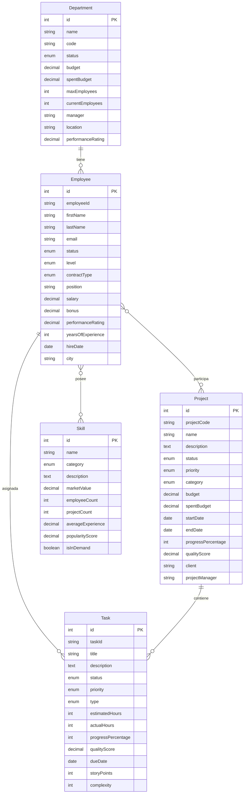

# Query Builder - Ejercicio 7

Este ejercicio demuestra el uso avanzado del **Query Builder** de TypeORM para construir consultas SQL complejas de forma programática y type-safe.

## 🎯 Objetivos del Ejercicio

- Dominar el Query Builder de TypeORM
- Implementar consultas SQL complejas
- Entender joins, agregaciones y subqueries
- Aplicar filtros dinámicos y paginación
- Optimizar consultas para mejor rendimiento

## 🏗️ Modelo de Datos

El ejercicio utiliza un sistema de gestión de empleados, proyectos y tareas con las siguientes entidades:

### Entidades Principales

1. **Department** - Departamentos de la empresa
2. **Employee** - Empleados con información completa
3. **Project** - Proyectos con equipos asignados
4. **Skill** - Habilidades técnicas y blandas
5. **Task** - Tareas individuales de proyectos

### Relaciones del Modelo



## 🔍 Consultas Implementadas

### 1. Query Builder Básico

```typescript
const activeEmployees = await AppDataSource.getRepository(Employee)
  .createQueryBuilder("employee")
  .select([
    "employee.id",
    "employee.firstName",
    "employee.lastName",
    "employee.salary",
  ])
  .where("employee.status = :status", { status: EmployeeStatus.ACTIVE })
  .andWhere("employee.salary > :minSalary", { minSalary: 50000 })
  .orderBy("employee.salary", "DESC")
  .limit(10)
  .getMany();
```

**Características:**

- Selección de campos específicos
- Filtros con parámetros seguros
- Ordenamiento múltiple
- Limitación de resultados

### 2. Joins Complejos

```typescript
const departmentsWithEmployees = await AppDataSource.getRepository(Department)
  .createQueryBuilder("dept")
  .leftJoinAndSelect("dept.employees", "employee")
  .where("dept.status = :status", { status: DepartmentStatus.ACTIVE })
  .orderBy("dept.name", "ASC")
  .getMany();
```

**Tipos de Join:**

- **LEFT JOIN**: Incluye registros sin relación
- **INNER JOIN**: Solo registros con relación
- **joinAndSelect**: Carga relaciones en consulta

### 3. Agregaciones

```typescript
const departmentStats = await AppDataSource.getRepository(Employee)
  .createQueryBuilder("employee")
  .leftJoin("employee.department", "department")
  .select("department.name", "departmentName")
  .addSelect("COUNT(employee.id)", "totalEmployees")
  .addSelect("AVG(employee.salary)", "averageSalary")
  .addSelect("MAX(employee.salary)", "maxSalary")
  .addSelect("MIN(employee.salary)", "minSalary")
  .groupBy("department.id")
  .having("COUNT(employee.id) > :min", { min: 0 })
  .getRawMany();
```

**Funciones de Agregación:**

- `COUNT()`: Conteo de registros
- `AVG()`: Promedio de valores
- `SUM()`: Suma de valores
- `MAX()` / `MIN()`: Valores extremos
- `GROUP BY`: Agrupación
- `HAVING`: Filtros sobre grupos

### 4. Subqueries

```typescript
const aboveAverageSalary = await AppDataSource.getRepository(Employee)
  .createQueryBuilder("employee")
  .where(
    "employee.salary > " +
      AppDataSource.getRepository(Employee)
        .createQueryBuilder("emp")
        .select("AVG(emp.salary)")
        .where("emp.status = :status", { status: EmployeeStatus.ACTIVE })
        .getQuery()
  )
  .getMany();
```

**Aplicaciones:**

- Comparaciones con promedios dinámicos
- Filtros basados en cálculos complejos
- Consultas correlacionadas

### 5. Consultas Complejas

```typescript
const complexSearch = await AppDataSource.getRepository(Employee)
  .createQueryBuilder("employee")
  .leftJoinAndSelect("employee.department", "department")
  .where("employee.status = :status", { status: EmployeeStatus.ACTIVE })
  .andWhere(
    "(employee.firstName LIKE :search OR employee.lastName LIKE :search)"
  )
  .andWhere("employee.salary BETWEEN :min AND :max", {
    min: 40000,
    max: 120000,
  })
  .andWhere("employee.level IN (:...levels)", {
    levels: [EmployeeLevel.SENIOR],
  })
  .orderBy("employee.performanceRating", "DESC")
  .getMany();
```

**Características:**

- Múltiples condiciones
- Operadores LIKE, BETWEEN, IN
- Búsquedas por texto
- Filtros por rangos

### 6. Paginación

```typescript
const [results, totalCount] = await AppDataSource.getRepository(Employee)
  .createQueryBuilder("employee")
  .where("employee.status = :status", { status: EmployeeStatus.ACTIVE })
  .orderBy("employee.salary", "DESC")
  .skip((page - 1) * pageSize)
  .take(pageSize)
  .getManyAndCount();
```

**Implementación:**

- `skip()`: Saltar registros
- `take()`: Limitar resultados
- `getManyAndCount()`: Obtener datos y total

### 7. Funciones de Fecha

```typescript
const recentHires = await AppDataSource.getRepository(Employee)
  .createQueryBuilder("employee")
  .where("employee.hireDate >= :oneYearAgo", {
    oneYearAgo: new Date(Date.now() - 365 * 24 * 60 * 60 * 1000),
  })
  .orderBy("employee.hireDate", "DESC")
  .getMany();
```

**Operaciones:**

- Comparaciones de fechas
- Cálculos temporales
- Filtros por períodos

### 8. Expresiones CASE WHEN

```typescript
const employeeCategories = await AppDataSource.getRepository(Employee)
  .createQueryBuilder("employee")
  .select("employee.firstName", "firstName")
  .addSelect(
    `
    CASE 
      WHEN employee.salary >= 100000 THEN 'Alto'
      WHEN employee.salary >= 60000 THEN 'Medio'
      ELSE 'Bajo'
    END
  `,
    "salaryCategory"
  )
  .getRawMany();
```

**Aplicaciones:**

- Categorización dinámica
- Lógica condicional
- Transformación de datos

### 9. Consultas Dinámicas

```typescript
let query =
  AppDataSource.getRepository(Employee).createQueryBuilder("employee");

if (filters.minSalary) {
  query = query.andWhere("employee.salary >= :minSalary", {
    minSalary: filters.minSalary,
  });
}

if (filters.level) {
  query = query.andWhere("employee.level = :level", {
    level: filters.level,
  });
}

const results = await query.getMany();
```

**Ventajas:**

- Construcción programática
- Filtros opcionales
- Reutilización de código

### 10. Consultas Raw

```typescript
const rawStats = await AppDataSource.query(`
  SELECT 
    d.name as department_name,
    COUNT(e.id) as total_employees,
    AVG(e.salary) as avg_salary,
    COUNT(CASE WHEN e.level IN ('senior', 'lead') THEN 1 END) as senior_count
  FROM employee e
  LEFT JOIN department d ON e.departmentId = d.id
  WHERE e.status = 'active'
  GROUP BY d.id, d.name
  ORDER BY avg_salary DESC
`);
```

**Casos de Uso:**

- Consultas muy complejas
- Funciones específicas de BD
- Optimizaciones avanzadas

## 🚀 Ejecución del Ejercicio

### Requisitos Previos

```bash
npm install
```

### Ejecutar el Ejercicio

```bash
npm run query-builder
```

### Script en package.json

```json
{
  "scripts": {
    "query-builder": "ts-node src/ejercicio-07-query-builder/example.ts"
  }
}
```

## 📊 Resultados Esperados

### Consultas Ejecutadas

1. **Query Builder Básico**: 10 empleados con salario > $50,000
2. **Joins Complejos**: 5 departamentos con sus empleados
3. **Agregaciones**: Estadísticas por departamento y nivel
4. **Subqueries**: Empleados con salario superior al promedio
5. **Consultas Complejas**: Búsqueda avanzada con múltiples filtros
6. **Paginación**: 3 empleados por página
7. **Funciones de Fecha**: Contrataciones recientes
8. **CASE WHEN**: Categorización de empleados
9. **Consultas Dinámicas**: Filtros programáticos
10. **Consultas Raw**: Estadísticas complejas con SQL nativo

### Métricas del Sistema

- **Empleados**: 10 empleados en 5 departamentos
- **Proyectos**: 5 proyectos con diferentes estados
- **Habilidades**: 10 skills técnicas y blandas
- **Tareas**: 10 tareas distribuidas en proyectos

## 🎓 Conceptos Clave

### Ventajas del Query Builder

1. **Type Safety**: Verificación de tipos en compilación
2. **Flexibilidad**: Construcción dinámica de consultas
3. **Rendimiento**: Control total sobre SQL generado
4. **Legibilidad**: Más claro que concatenar strings
5. **Reutilización**: Consultas modulares

### Mejores Prácticas

1. **Usar parámetros** para evitar SQL injection
2. **Limitar resultados** con `take()` y `skip()`
3. **Optimizar joins** cargando solo datos necesarios
4. **Indexar campos** de búsqueda frecuente
5. **Monitorear consultas** para identificar cuellos de botella

### Métodos de Resultado

- `.getMany()`: Múltiples registros como entidades
- `.getOne()`: Un registro o null
- `.getCount()`: Solo conteo
- `.getManyAndCount()`: Datos y conteo total
- `.getRawMany()`: Datos sin mapear a entidades
- `.getRawOne()`: Un registro raw

## 🔧 Casos de Uso Comunes

### Búsquedas Avanzadas

```typescript
const searchResults = await repository
  .createQueryBuilder("entity")
  .where("entity.name LIKE :search", { search: `%${term}%` })
  .andWhere("entity.status = :status", { status: "active" })
  .orderBy("entity.createdAt", "DESC")
  .getMany();
```

### Reportes y Analytics

```typescript
const monthlyReport = await repository
  .createQueryBuilder("sale")
  .select("DATE_FORMAT(sale.date, '%Y-%m')", "month")
  .addSelect("SUM(sale.amount)", "total")
  .addSelect("COUNT(*)", "count")
  .where("sale.date >= :startDate", { startDate: oneYearAgo })
  .groupBy("month")
  .orderBy("month", "DESC")
  .getRawMany();
```

### Dashboards

```typescript
const dashboardData = await repository
  .createQueryBuilder("order")
  .select("COUNT(CASE WHEN order.status = 'pending' THEN 1 END)", "pending")
  .addSelect(
    "COUNT(CASE WHEN order.status = 'completed' THEN 1 END)",
    "completed"
  )
  .addSelect("AVG(order.amount)", "averageAmount")
  .where("order.date >= :today", { today: new Date() })
  .getRawOne();
```

## 📚 Recursos Adicionales

- [TypeORM Query Builder Documentation](https://typeorm.io/select-query-builder)
- [SQL Performance Tuning](https://use-the-index-luke.com/)
- [Database Design Best Practices](https://www.postgresql.org/docs/current/indexes.html)

## 🏆 Ejercicios Propuestos

1. **Consulta de Productividad**: Crear una consulta que muestre la productividad de cada empleado basada en tareas completadas vs. horas trabajadas.

2. **Análisis de Proyectos**: Implementar un reporte que muestre proyectos en riesgo basado en presupuesto, cronograma y calidad.

3. **Gestión de Talento**: Crear consultas para identificar empleados con alto potencial basado en performance, skills y experiencia.

4. **Optimización de Equipos**: Desarrollar consultas para formar equipos óptimos basados en skills complementarias.

5. **Predicción de Costos**: Implementar consultas que proyecten costos futuros basados en tendencias históricas.

## 🎯 Conclusión

El Query Builder de TypeORM es una herramienta poderosa que permite:

- Construir consultas complejas de forma type-safe
- Mantener flexibilidad y rendimiento
- Facilitar el mantenimiento y testing
- Integrar consultas avanzadas en aplicaciones

Este ejercicio demuestra cómo aplicar diferentes técnicas de consulta para resolver problemas reales en sistemas de gestión empresarial.
